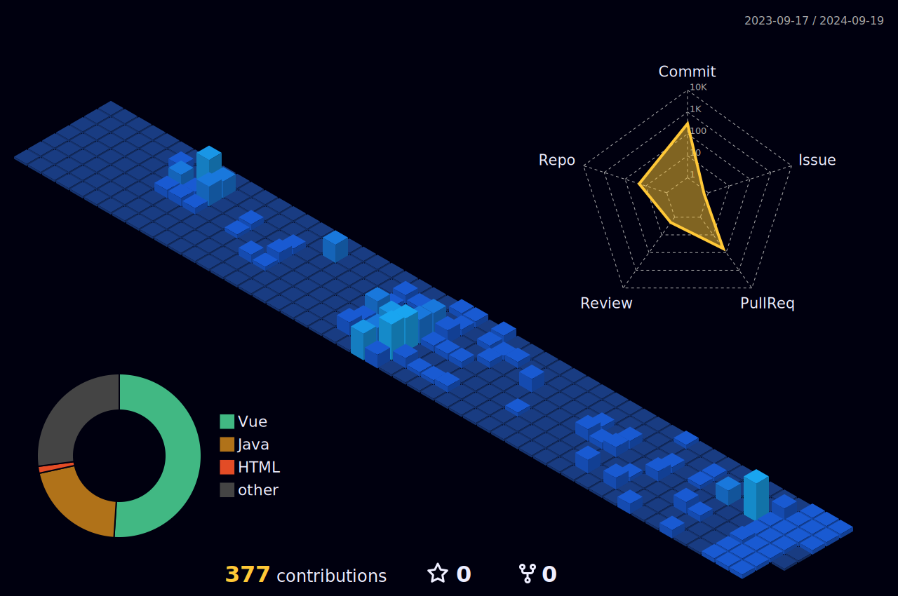

            
  📔 hello! this is my portfolio 
   
  [portfolio](https://www.notion.so/94577b646a354868bd69c0855536eab9?pvs=25)
   
  

    

 
 

  &nbsp; 🛠️&nbsp; Tools&nbsp; & &nbsp;Skill

   

   
  
✍️ Framework &amp; Language

  &nbsp; &nbsp; &nbsp; 
  
   
   
   
  
💾 Database

  &nbsp; &nbsp; &nbsp; 
   
  
   
   
   
  
🖥️ OS (Linux)

  &nbsp; &nbsp; &nbsp; 
  
  
   
   
   
  
🛜 Server

  &nbsp; &nbsp; &nbsp; 
  
   
   
   
  
 AWS

  &nbsp; &nbsp; &nbsp; 
  
   
   
   
   
  
 Frontend

  &nbsp; &nbsp; &nbsp; 
   
   
   
  
 Test

  &nbsp; &nbsp; &nbsp; 
  
  
  
   
   
   
  
 CI/CD

  &nbsp; &nbsp; &nbsp; 
  
  
   
   
   
  
 Cooperation

  &nbsp; &nbsp; &nbsp; 
  
  
  

